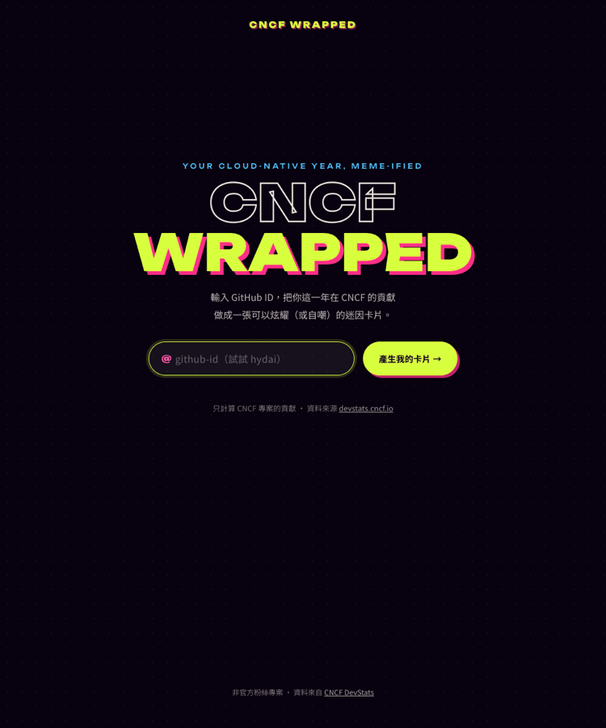
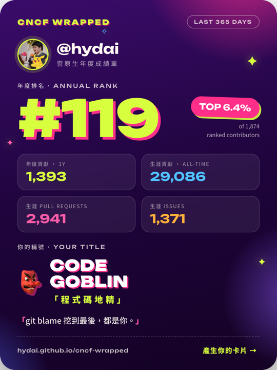

# CNCF Wrapped 🎁

[English](README.md) | 繁體中文

[](https://github.com/hydai/cncf-wrapped/actions/workflows/deploy.yml)
[](LICENSE)

**你的雲原生年度迷因卡。** 輸入 GitHub ID，把你在 CNCF 專案的貢獻做成一張
Spotify Wrapped 風格的卡片，一鍵下載 / 複製 PNG，貼到 X、Slack、Discord
炫耀（或自嘲）。

**Live: <https://hydai.github.io/cncf-wrapped/>**

| 首頁 | 卡片（PNG 匯出） |
| --- | --- |
|  |  |

## 卡片內容

- 頭像 + GitHub ID
- 年度排名 `#N` + `TOP X%` 徽章（榜外使用者只顯示貢獻數）
- 年度貢獻數、生涯總貢獻（含 PRs / Issues 細項）
- 迷因稱號：由年度各 metric 中數量最高者決定
  - PRs →「Merge Machine 合併機器」
  - Comments →「Comment Maestro 評論大師」
  - Issues →「Bug Whisperer 蟲語者」
  - Commits →「Code Goblin 程式碼地精」
  - 年度排名進 Top 10 再加掛 **⚡ THE MACHINE**
- 每個稱號一個雙語迷因文案池，隨機抽一句
- 介面 zh-TW / English 切換（分享連結可帶 `?lang=zh|en`）

## 開發者每日運勢 🎋

廟籤風彩蛋，路由 `?fortune=<github-id>`（首頁與卡片頁都有入口按鈕）：抽出
你的**今日開發運勢**——運勢等級（大吉 → 凶（可逆））、開發者梗籤詩、宜／忌
兩欄、幸運 git 指令、摻入真實年度 commits 數的幸運時辰、幸運 Emoji。

- **確定性抽籤**：seed = hash(login + 當地日期)，同一人同一天抽到的結果
  必定相同（雙語一致），可以互相比較；明天再來換新籤。
- **真實資料開光**：卡面以你的 DevStats 真實數據開光（生涯貢獻、年度
  Commits、排名），查無此人／榜外也能抽（會顯示趣味 fallback）。
- 跟主卡片一樣可匯出 PNG。僅供娛樂——資料是真的，運勢是玩的。

## 資料來源與計算方式

所有資料來自 [CNCF DevStats](https://devstats.cncf.io) 的公開 API
（`POST https://devstats.cncf.io/api/v1`，CORS 開放，瀏覽器直打）：

| 用途 | API |
| --- | --- |
| 生涯總貢獻 | `GithubIDContributions` |
| 年度排名 / 各 metric 數量 | `DevActCnt`（project=all, range=Last year） |
| 百分位分母（上榜總數） | `DevActCnt`（`github_id: ""` 取全榜） |
| 全站數字 | `SiteStats` |

- **排名**由 DevStats 計算，本站原樣呈現、不加工。
- **上榜總數**是排行榜長度——榜單有貢獻門檻、低於門檻不入榜，所以遠小於
  全站 contributors 總數。
- **Top X%** = 排名 ÷ 上榜總數 × 100，無條件進位到小數一位（寧可低估、
  不誇大），語意是「上榜貢獻者中的百分位」，不是全體 CNCF 貢獻者。
- 榜外使用者只顯示貢獻數，不顯示排名與百分比。
- DevStats 約每小時更新；本站另以 localStorage 快取 1 小時。

每張卡片下方也有 ℹ️「這些數字怎麼算」說明區塊。

## 技術

- Vite + React + TypeScript 純靜態 SPA（GitHub Pages，無後端）
- 卡片路由用 `?user=<github-id>` query param，Pages 子路徑友善
- 介面 zh-TW / English 雙語：typed dictionary + `useContext`（零 i18n 框架），
  判定順序 `?lang=` param > localStorage > `navigator.language`
- PNG 由瀏覽器端 [html-to-image](https://github.com/bubkoo/html-to-image)
  產生：下載 / Clipboard API 複製 / Web Share API（行動裝置）
- 頭像經 `fetch → blob → dataURL` 載入，避免 canvas taint
- 字型：Unbounded + Noto Sans TC（Fontsource 自架，匯出 PNG 不跑版）

## 快速開始

需要 Node.js 22+。

```bash
npm install
npm run dev        # http://localhost:5173/cncf-wrapped/
npm test           # vitest（fetch 全部 mock，不打真實 API）
npm run build      # tsc + vite build → dist/
```

## 部署

Push 到 `master` 會觸發 GitHub Actions（`.github/workflows/deploy.yml`）：
測試 → build → 部署到 GitHub Pages。

## 貢獻

見 [CONTRIBUTING.md](CONTRIBUTING.md)（英文）。特別歡迎供稿新迷因文案與
新稱號點子。

## License

[Apache-2.0](LICENSE)。非官方粉絲專案，與 CNCF 無關；資料版權屬於各原始
專案與 CNCF DevStats。
